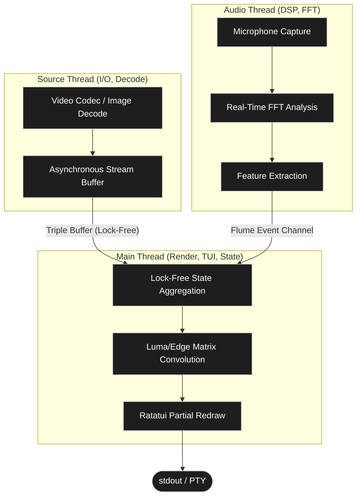

<div align="center">

# clasSCII Engine

**Real-time, audio-reactive ASCII/Unicode rendering engine for terminal-based TUI applications.**<br>
*Engineered for deterministic execution in constraint-heavy CLI environments.*

[](https://github.com/FeelTheFonk/ASCIIFORGE/actions)
[](https://rust-lang.org)
[](https://opensource.org/licenses/MIT)

</div>

<br>

> [!CAUTION]
> Hardware Acceleration Requirement: To prevent rendering computation bottlenecks, deployment environments must utilize a GPU-accelerated terminal emulator (e.g., Alacritty, Kitty, WezTerm).

> [!IMPORTANT]
> Zero-Allocation Guarantee: The engine strictly enforces a zero-allocation policy (`Vec` creation, `String` allocation) within the active rendering loop. All mutating states are processed in-place strictly within pre-allocated boundaries.

---

<details open>
<summary><b>Table of Contents</b></summary>

- [1. System Architecture & Concurrency Model](#1-system-architecture--concurrency-model)
- [2. Algorithmic Complexity & Signal Processing](#2-algorithmic-complexity--signal-processing)
- [3. Workspace Topology & Internal Specifications](#3-workspace-topology--internal-specifications)
- [4. Deployment, Build & Compilation Profiles](#4-deployment-build--compilation-profiles)
- [5. Usage & Pipeline Instantiation](#5-usage--pipeline-instantiation)
- [6. Real-Time Telemetry & Controls](#6-real-time-telemetry--controls)
- [7. Configuration & State Management](#7-configuration--state-management)
- [8. Quality Assurance & Structural Safety](#8-quality-assurance--structural-safety)

</details>

---

## 1. System Architecture & Concurrency Model

clasSCII implements a lock-free, zero-allocation three-thread topology to guarantee stable frame rates under high Digital Signal Processing (DSP) loads.

### Core Pipeline Topology



- Inter-Process Communication (IPC): Lock-free memory synchronization is achieved via `triple_buffer` for frame payloads and non-blocking `flume` channels for event signaling. This architecture theoretically eliminates mutex contention and false sharing across CPU cache lines.

## 2. Algorithmic Complexity & Signal Processing

The translation of binary streams into Unicode abstractions relies on continuous signal processing and discrete spatial convolution.

### Digital Signal Processing (DSP)

Operates a continuous Fast Fourier Transform (FFT) analysis loop. The discrete Fourier representation operates over windowed matrices $x_n$:

$$
X_k = \sum_{n=0}^{N-1} x_n \cdot e^{-i 2 \pi k n / N}
$$

Windowing functions and localized smoothing filters extract crest frequencies and percussive transients for real-time state mutations.

### Visual Matrix Translation

The mapping algorithm utilizes perceptual luminance computation:

$$
Y = 0.2126R + 0.7152G + 0.0722B
$$

It implements finite impulse response (FIR) kernel-based edge detection and high-density Unicode spatial quantization (Braille, Quadrants) to map continuous pixel structures within a discrete character grid.

### Render Output Gating

Terminal byte-bandwidth is computationally gated. Utilizing `ratatui`'s buffer diffing state algorithms, I/O bound operations (`stdout` writes) are minimized via calculated partial frame redraws.

## 3. Workspace Topology & Internal Specifications

The codebase is partitioned into 6 modular crates to enforce strict hardware-layer isolation.

| Crate | Abstraction Layer | Core Responsibilities |
|-------|-------------------|-----------------------|
| `af-core` | Shared Primitives | Traits, unified configuration matrix, core `triple_buffer` topologies. |
| `af-audio` | Signal Processing | Audio capture (CPAL), FFT analysis, beat detection matrices. |
| `af-ascii` | Visual Algorithms | Luma-to-ASCII projection, convolution kernels, Braille/Halfblock/Quadrant quantization. |
| `af-render` | Display Backend | Terminal rendering (`ratatui`), partial redraws, hardware FPS target logic. |
| `af-source` | Input Pipeline | Stream decoders (Image buffers, FFmpeg, V4L2 Webcams, procedural generators). |
| `af-app` | Orchestrator | Application entry point, thread lifecycle daemon, explicit pipeline construction. |

## 4. Deployment, Build & Compilation Profiles

Designed to utilize full LLVM compiler optimizations (`LTO = "fat"`, `codegen-units = 1`) for the release target.

> [!NOTE]
> System Dependencies: Compiling with the `video` feature requires C-ABI linkage libraries. Ensure `libavformat-dev`, `libavutil-dev`, `libavcodec-dev`, and `libswscale-dev` are present in the host environment.

```bash
# Development Profile (Fast compilation, unoptimized binary)
cargo build --workspace

# Production Profile (Maximized optimization, LTO enabled, Video pipeline active)
cargo build --release --features video
```

## 5. Usage & Pipeline Instantiation

```bash
# Static visual payload allocation
classcii --image path/to/image.png

# Visual payload modulated by continuous microphone reactivity
classcii --image path/to/image.png --audio mic

# Video stream decoded concurrently with embedded audio
classcii --video path/to/video.mp4

# Algorithmic override (Strict topology and deterministic polling rate)
classcii --image photo.jpg --mode braille --fps 60

# Configuration preset mapping
classcii --image photo.jpg --preset psychedelic
```

## 6. Real-Time Telemetry & Controls

Dynamic hot-reloading native support ensures thread persistence during structural state modifications.

<details>
<summary><b>Expand Keyboard Bindings Matrix</b></summary>

| Keybind | Assigned Action |
|---------|-----------------|
| `Tab` | Cycle render topology (`Ascii` → `HalfBlock` → `Braille` → `Quadrant`) |
| `1`–`5` | Select target character set mapping matrix |
| `c` | Toggle chromatic ANSI sequence mode |
| `i` | Invert luminance coordinate scalar |
| `e` | Toggle convolutional edge detection pass |
| `s` | Toggle nearest-neighbor shape matching interpolation |
| `m` | Cycle color quantization strategy |
| `b` | Cycle background buffer style |
| `d` / `D` | Render density scalar ($\pm 0.25$) |
| `[` / `]` | Viewport contrast scalar ($\pm 0.1$) |
| `{` / `}` | Viewport brightness scalar ($\pm 0.05$) |
| `-` / `+` | Global saturation scalar ($\pm 0.1$) |
| `f` / `F` | Temporal fade decay polynomial ($\pm 0.1$) |
| `g` / `G` | Post-process glow amplitude ($\pm 0.1$) |
| `↑` / `↓` | Audio DSP reactivity sensitivity scalar ($\pm 0.1$) |
| `←` / `→` | Data stream absolute positional seek ($\pm 5$s) |
| `Space` | Pause/Resume engine computation pipeline |
| `?` | Toggle telemetry & hardware diagnostic overlay |
| `q` / `Esc` | Terminate application process gracefully |

</details>

## 7. Configuration & State Management

**Defined Boundaries:** `config/default.toml`  
**Presets Schema Directory:** `config/presets/*.toml`

```bash
classcii --image photo.jpg --config my_config.toml
classcii --image photo.jpg --preset ambient
```

## 8. Quality Assurance & Structural Safety

- **Panic-Free Runtime Guarantee:** The invocation of `unwrap()` or `expect()` is structurally barred outside testing modules. Exceptions are bubbled, typed (`Result<T, E>`), and deterministically logged.
- **Static Analysis Integrity:** `cargo clippy --workspace -- -D warnings` must strictly evaluate to `0` warnings prior to integration.
- **Memory Safety Constraints:** All Foreign Function Interfaces (`FFI`) and raw pointer arithmetic logic are strictly bounded within `unsafe { ... }` blocks and subjected to explicit manual audits.

## 9. License

MIT
